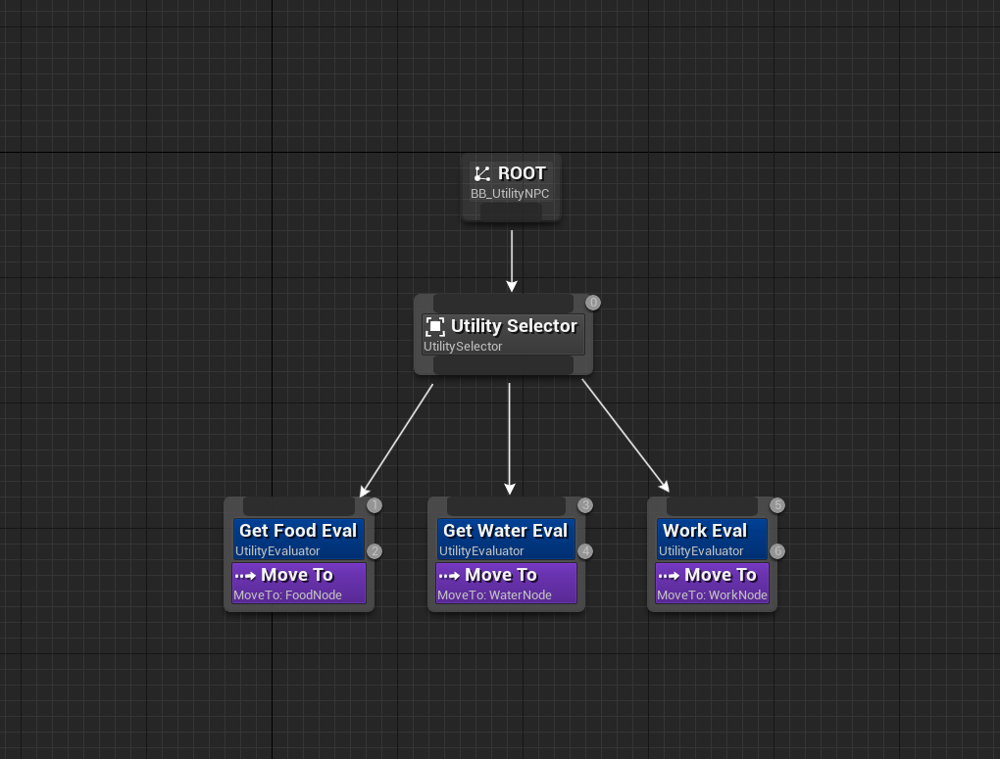
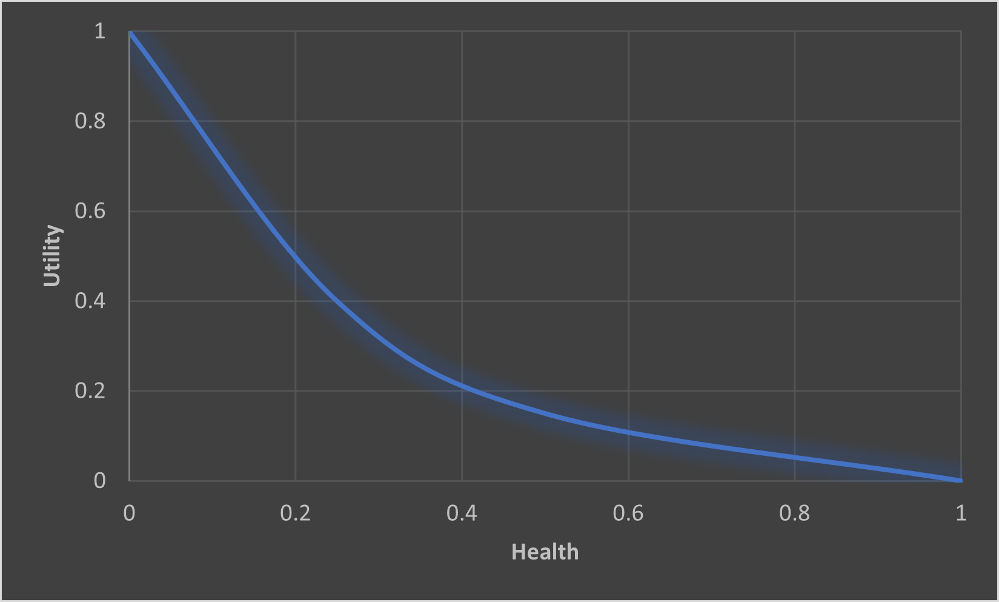
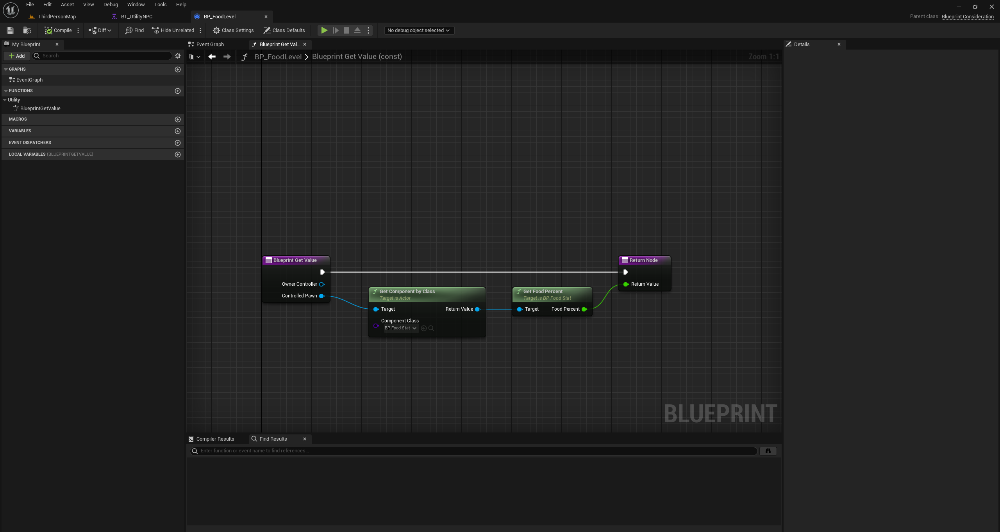
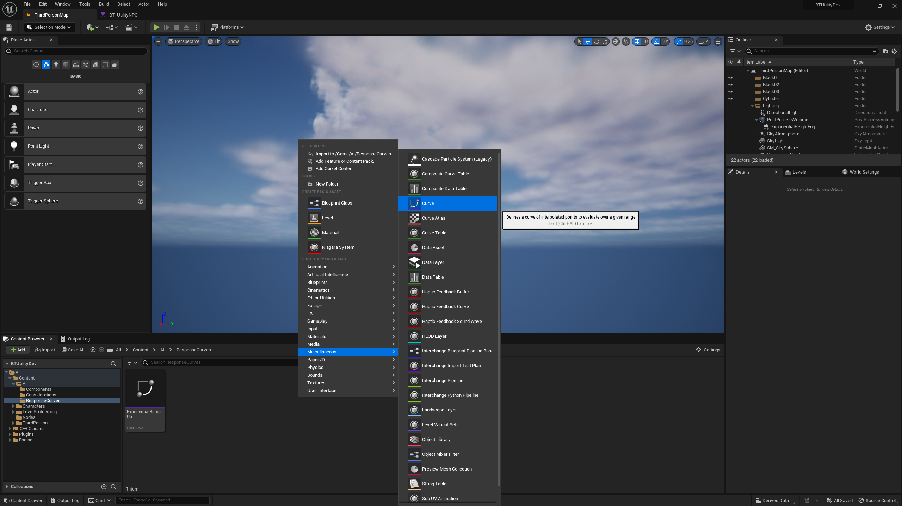
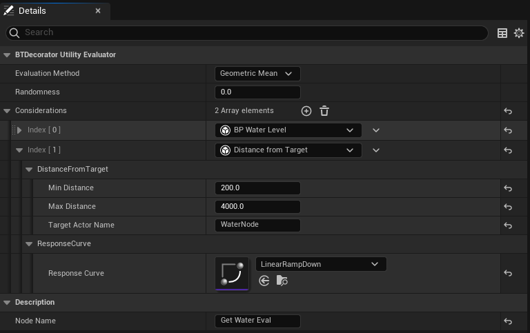

# BT Utility Decision

## Overview



A lightweight extension to the Unreal Engine's Behavior Tree System, introducing nodes that facilitate utility-based decision making:

* A Consideration which queries the game state and ouputs a score based on the assigned response curve.
* A Utility Evaluator that calculates and returns a utility score based on considerations it holds and other parameters.
* A Utility Selector that executes its children based on their utility score in descending order.

## Installation

1. Download the ZIP
2. Create "Plugins" folder in the project root directory
3. Place the ZIP inside the Plugins folder and extract
4. Run the project

## Usage

### Consideration

A consideration represents an AI agent's query of the game state, such as its current health or a distance to a target.
A consideration has two components, a raw value and a response curve.
A consideration's score is the value of a response curve at the point in time specified by the raw value, which is also between 0 and 1.
By modelling considerations on a curve, it allow developers to modify the raw value in a versitile manner, be it inverting it, or making it scale exponentially.



A raw value can be defined by creating a consideration, while the response curve can be defined by a CurveFloat asset.

To create a consideration:

* C++: Inherit from the Consideration class and override its GetValue() function.
```C++
/**
 * A UObject allowing one to create a consideration for an AI agent (e.g. hunger, thirst etc)
 */
UCLASS(BlueprintType, EditInlineNew, DefaultToInstanced, Abstract)
class BTUTILITYDECISION_API UConsideration : public UObject
{
	GENERATED_BODY()

public:
	/** Returns a value of the response curve at the point in time specified by the GetValue() */
	float EvaluateScore(UBehaviorTreeComponent& OwnerComp) const;

protected:
	/** Returns a raw value for the consideration. Value must be normalized between 0 and 1 */
	virtual float GetValue(UBehaviorTreeComponent& OwnerComp) const;

private:
	/** A float curve used for transforming the consideration's value into a score  */
	UPROPERTY(EditAnywhere, Category = ResponseCurve)
	TObjectPtr<UCurveFloat> ResponseCurve;
};
 ```
* Blueprints: Inherit from the BlueprintConsideration class and override the BlueprintGetValue() function.


It is important that the raw value returned from these functions are between 0 to 1.
This is to ensure that the game world data that considerations use are all normalized to a scale where they can be all compared equally.
For example, an ammo count of 20 and a health value of 50 do not hold any meaning on their own.
However, if they are normalized against some maximum value, such as max ammo count of 25 and max health of 1000, then
we intuitively know that we have enough ammo, while our health is very low.

#### Response Curve

To create a response curve:
* Right click on the content browser -> Miscellaneous -> Curve -> CurveFloat


For the same reason as the raw value, ensure that the curve is also normalized between 0 and 1.

### Utility Evaluator



A utility evaluator is a decorator node that holds an array of considerations. The utility score it returns is calculated using the considerations' scores, 
the evaluation method as well as the randomness value.

#### Evaluation Method
The evaluation method determines how the evaluator will calculate its utility score. There are four options:
* Geometric Mean: Use the multiplicative average of consideration scores
* Arithmetic Mean: Use the additive average of consideration scores
* Min: Use the lowest consideration score
* Max: Use the highest consideration score

#### Randomness

This determines the amount of randomness to apply to the utility score. 
It works as a maximum random reduction of the score, with 0 being no reduction and 1 being potential 100% reduction.
The effect is similar to weighted random selection, but it allows for more precise control over the randomness.

#### Considerations Array

A consideration can be added to the evaluator by adding an element to its array, and selecting it from the dropdown. From there, developers can modify the exposed parameters of their considerations,
as well as assigning any response curve they've created.

For blueprint considerations, developers can assign a response curve inside the blueprint to define the default curve. 
When they select the consideration in the dropdown afterwards, the curve will already be set.

### Utility Selector

A Utility selector behaves like a traditional selector in that it will attempt to go through all its children one by one until one of them succeeds.
A difference lies in how they prioritise children. While the normal selector prioritises children from left to right, a utility selector will dynamically prioritise the highest scoring child first,
and the lowest scoring child last. The ordering is determined each time the UtilitySelector is activated, and does not re-evaluate until the child finishes its execution.
  
## Limitations
  
As mentioned in the Utility Selector section, the current system does not allow for re-evaluation until the child has finished its tasks. This means that long-running latent actions such as 
Wait or MoveTo can not be aborted even other children now has a higher utility score.
